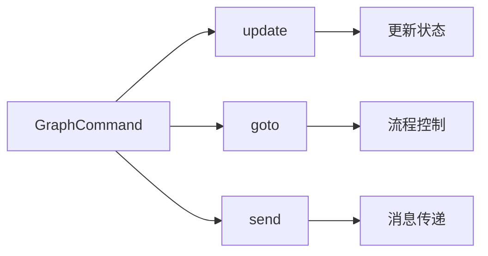
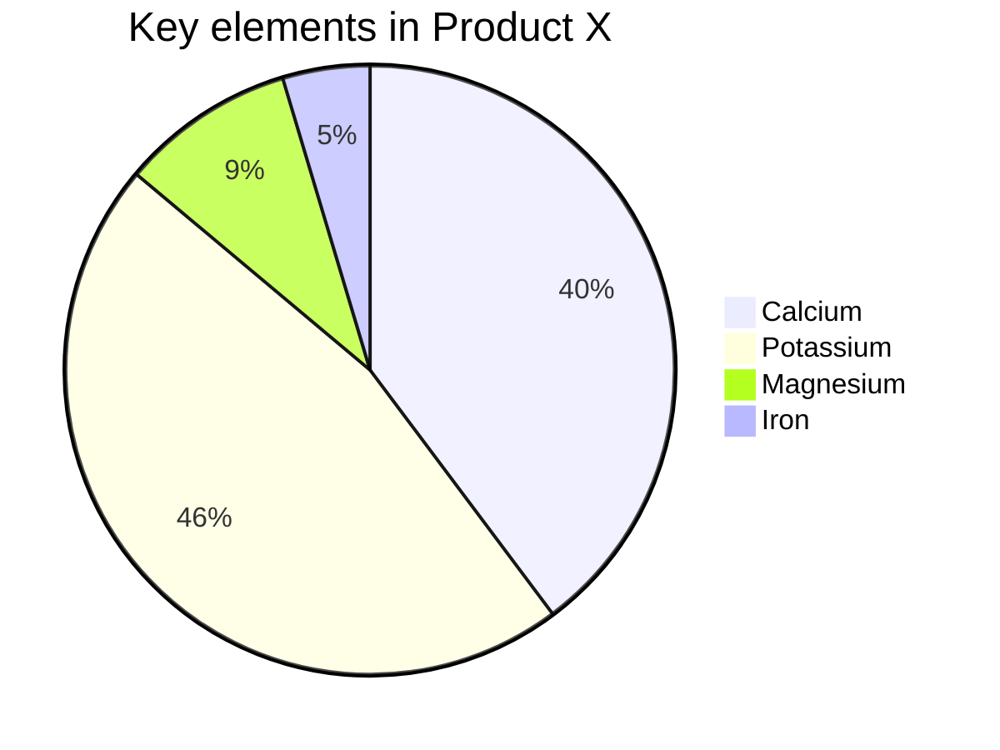

# Docs^red:+^ 基础 Markdown 语法

<center style="font-size:90%"><i>Docs<sup style="color:red;">+</sup> 基于 <a href="https://github.com/doocs/md" target="_blank" rel="noopener noreferrer">Doocs</a></i></center>

## 前言

> We believe that writing is about content, about what you want to say – not about fancy formatting.
> 我们坚信写作写的是内容，所思所想，而不是花样格式。— Ulysses for Mac


## 标题

用 `#` 号来创建标题。标题从 `#` 开始，`#` 的数量表示标题的级别。

```markdown
# 一级标题

## 二级标题

### 三级标题

#### 四级标题
```

以上代码将渲染出一组层次分明的标题，使你的内容井井有条。

## 段落与换行

Markdown 中的段落就是一行接一行的文本。要创建新段落，只需在两行文本之间空一行。

## 文字样式

- **粗体**：用两个星号或下划线包裹文字或`Command + B`，如 `**粗体**` 或 `__粗体__`。 
- _斜体_：用一个星号或下划线包裹文字或`Command + I`，如 `*斜体*` 或 `_斜体_`。
- ~~删除线~~：用两个波浪线包裹文字或`Command + D`，如 `~~删除线~~`。
- ++下划线++：用两个 `+` 包裹文字或`Command + U`，如 `++下划线++`。

这些简单的标记可以让你的内容更有层次感和重点突出。另外 Docs^red:+^ 还提供额外的样式设置，快捷键：`Command + J`

=white:theme:12 白色文字，主题色背景，12px 大小的文字=

=white:black:12 白色文字，黑色背景，12px 大小的文字=

## 上标下标

- **上标**：用`^`包裹上标并可通过`:`指定颜色。`Command + Option + P`
` Docs^red:+^ ` ： Docs^red:+^ 。 
` Docs^theme:+^ `：跟随主题色。Docs^theme:+^
- **下标**：用`～`包裹上标并可通过`:`指定颜色。`Command + Option + B`
` H~red:2~O^ ` ： H~red:2~O 。 
` H~theme:2~O^ `：跟随主题色。H~theme:2~O^。 

## 列表

- **无序列表**：用 `-`、`*` 或 `+` 加空格开始一行。`Command + Option + U`
- **有序列表**：使用数字加点号（`1.`、`2.`）开始一行。`Command + Option + O`


在列表中嵌套其他内容？只需缩进即可实现嵌套效果。

- 无序列表项 1
  1. 嵌套有序列表项 1
  2. 嵌套有序列表项 2
- 无序列表项 2

1. 有序列表项 1
2. 有序列表项 2

## 链接与图片

- **链接**：用方括号和圆括号创建链接 `Command + K`
`[访问 Docs^red:+^ ](https://github.com/iniself/md)`。[访问 Docs^red:+^ ](https://github.com/iniself/md)。
 =rgb(128, 128, 128)::90% 微信公众号平台不支持除公众号内容以外的链接。或点击左上角「格式->微信外链接转底部引用」开启引用，这样就可以在底部++引用链接++处看到链接指向。=
- **知乎卡片链接**：链接外层再叠加括号 `[[显示文本](链接地址)]`。`Command + Option + K`
- **图片**：和链接类似，只需在前面加上 `!`。Docs^red:+^ 支持定义图片长宽（`px` | `%`）和填充方式（`contain` | `cover` | `fill` ...）：
````

另外，使用 `<,>` 语法可以创建横屏滑动幻灯片，支持微信公众号平台。建议使用相似尺寸的图片以获得最佳显示效果。

## 引用

使用 `>` 来创建引用，只需在文本前面加上它。多层引用？在前一层 `>` 后再加一个就行。

> 这是一个引用
>
> > 这是一个嵌套引用

这让你的引用更加富有层次感。

## 代码块

- **行内代码**：用反引号包裹，如 `` `code` `` ：code`。
- **代码块**：用三个反引号包裹，并指定语言，如：
  ```js
  console.log("Hello, You!");
  ```
- **纯英语排版**：用三个反引号包裹，语言用 `en`，如：
  ```en
  Digital businesses will not long survive processes that rely on ++individual heroes++. To satisfy the demands of, say, a typical user of an app, mobile transactions must be reliable and seamless. This means that, to play in the digital economy, companies need to replace their dysfunctional systems and processes with an operational backbone.
  ```
- **居中文字**：用三个反引号包裹，语言用 `center`，如：
  ```center
  =default:: *居中文字*=
  ```

## 提示块

Docs^red:+^ 支持 Admonition 语法， `Command + Option + A`。包括如下提示类型：
`abstract/attention/bug/caution/danger/error/example/failure/hint/info/note/question/quote/success/tip/warning`

!!! bug 越界访问，索引 3 不存在 
```rust
fn main() {
    let nums = vec![1, 2, 3];
    println!("{}", nums[3]); 
}
```
!!!

## GFM alerts
支持 GFM 风格的`NOTE`、`TIP`、`IMPORTANT`、`WARNING`、`CAUTION`

> [!TIP]
> Optional information to help a user be more successful.

## 分割线

用三个或更多的 `-`、`*` 或 `_` 来创建分割线。

---


## 注释
不想渲染出来的 markdown 内容可以通过 `<!--  -->` 进行注释。`Command + /`

<!-- # 被注释的内容 -->

## 表格

Markdown 最简单的表格语法是，用 `|` 和 `-` 分隔单元格和表头。通过左上方点击「编辑->插入表格」，可快速生成表格。

### 基本表格

| 成员 | 性别 | 年龄 |
| --- | --- | --- |
|张三       | 男      |  28      |
|李四       | 男      |  33     |
|王五       | 女      |  21     |

另外 Docs^red:+^ 还提供了更高级的表格用法：


### 合并列


| 成都      | 绵阳      | 自贡      |
|---------|---------|---------|
|四川省  |||


### 合并行

| 省          | 城市      |
|--------------|---------|
| 四川    | 成都  |
| ^| 绵阳  |
| ^|  自贡  |

### 合并行和列

| 这个表头合并   || 表头 A |
|了两行和两列^|| 表头 B |
|-------------|------------|----------|
| 单元格 A      |单元格 B     |单元格 C   |

### 指定列宽

|列一|列二|列三|
|--10%-----|-- 40% ---|:---50%-----|
|10% 宽度|40%宽度|50%宽度|

### 列样式

|cols       |       |
| --- | --- |
|⭐️⭐️⭐️⭐️⭐️|主数据管理|
|⭐️⭐️|元数据管理|
|⭐️⭐️⭐️⭐|数据标准建设|
|⭐️⭐️⭐️⭐️⭐️|数据质量监控|

### CSV 样式

```csv
成员,性别,年龄
张三,男,28
李四,男,33
王五,女,21
```

CSV 分隔字符可以是`,`  `，` 和 `tab`

# Docs^red:+^ 进阶 Markdown 语法

## LaTeX 公式：完美展示数学表达式

Markdown 允许嵌入 LaTeX 语法展示数学公式：

- **行内公式**：用 `$` 包裹公式，如 `$E = mc^2$` $E = mc^2$。
- **块级公式**：用 `$$` 包裹公式，如：

  $$
  \begin{aligned}
  d_{i, j} &\leftarrow d_{i, j} + 1 \\
  d_{i, y + 1} &\leftarrow d_{i, y + 1} - 1 \\
  d_{x + 1, j} &\leftarrow d_{x + 1, j} - 1 \\
  d_{x + 1, y + 1} &\leftarrow d_{x + 1, y + 1} + 1
  \end{aligned}
  $$

1. 列表内块公式 1
    $$
    \chi^2 = \sum \frac{(O - E)^2}{E}
    $$
    
2. 列表内块公式 2
    $$
    \chi^2 = \sum \frac{(|O - E| - 0.5)^2}{E}
    $$

## Mermaid 流程图：可视化流程

Mermaid 是强大的可视化工具，可以在 Markdown 中创建流程图、时序图等。Doc^red:+^ 支持设置图形大小和标题。


---


---


---

> 更多用法，参见：[Mermaid User Guide](https://mermaid.js.org/intro/getting-started.html)。

## Ruby 注音：注音标注

支持两种格式：

```md
1. [文字]{注音}
2. [文字]^(注音)
```

渲染效果如下：

[你好]{nǐ hǎo} [世界]{shì jiè}

支持四种分隔符： `・`（中点）、`．` (全角句点)、`。` (中文句号)、`-` (英文减号)

示例：

```md
[你好世界]{nǐ・hǎo・shì・jiè}
[小夜時雨]^(さ・よ・しぐれ)
```

[你好世界]{nǐ・hǎo・shì・jiè}
[小夜時雨]^(さ・よ・しぐれ)

当字符串数量与分隔符数量不匹配时，会自动匹配到最合适的分隔符。

```md
[小夜時雨]{さ・よ・しぐれ}
[小夜時雨]{さ・よ}
[小夜]{さ・よ・しぐれ}
[小夜時雨]{さ・よ・しぐれ・extra}
```

[小夜時雨]{さ・よ・しぐれ}
[小夜時雨]{さ・よ}
[小夜]{さ・よ・しぐれ}
[小夜時雨]{さ・よ・しぐれ・extra}

## Infographic 信息图：可视化数据

新一代信息图可视化引擎，让文字信息栩栩如生！

```infographic
infographic list-row-horizontal-icon-arrow
data
  title 客户增长引擎
  desc 多渠道触达与复购提升
  items
    - label 线索获取
      value 18.6
      desc 渠道投放与内容获客
      icon rocket-launch
    - label 转化提效
      value 12.4
      desc 线索评分与自动跟进
      icon progress-check
    - label 复购提升
      value 9.8
      desc 会员体系与权益运营
      icon account-sync
    - label 口碑传播
      value 6.2
      desc 社群激励与推荐裂变
      icon account-group
```

> 更多用法，参见：[AntV Infographic Gallery](https://infographic.antv.vision/gallery)。

## Chat 聊天样式

通过 markdown 语法生成漂亮的聊天页面

!!! chat
roles:
 Docs^red:+^ as docs, avatar=/md/assets/images/aui.jpg

>> right docs
这段语法会展示一个聊天页面。同时支持 Docs^red:+^ 所有语法。比如下面就是嵌在聊天中的一个 Admonition 提示块

!!! note 标题
Docs^red:+^ 是个 markdown 写作工具
!!!

>> left docs
还可以是表格、代码块、图片等。所有 Docs^red:+^ 语法都可以嵌入 chat 语法中

| 模块 | 功能点 | 状态 | 负责人 | 备注 |
|------|--------|------|--------|------|
| Chat | 消息渲染 | ✅ 已完成 | Metaer | 支持嵌套块 |
| Note | Admonition | 🛠 优化中 | Jason | 暗色模式修复 |

```rust
pub fn group_messages_by_role(
    messages: &[ChatMessage],
) -> HashMap<&str, Vec<&ChatMessage>> {
    let mut grouped: HashMap<&str, Vec<&ChatMessage>> = HashMap::new();

    for msg in messages.iter() {
        grouped
            .entry(msg.role.as_str())
            .or_insert_with(Vec::new)
            .push(msg);
    }

    grouped
}
```


!!!

通过菜单 `格式 → 聊天样式` 或 `Command + Option + C` 可以快速插入聊天样式语法。

## 结语

淘汰一切以打印为目的的文档格式。内容和样式分离才是面向 AI 时代正确的写作方式。加我微信 **Aui_Team** 聊天。


