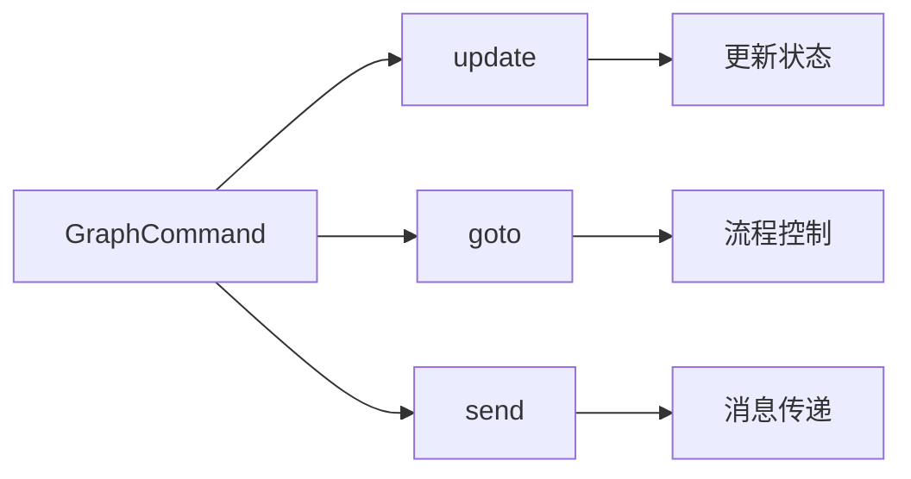
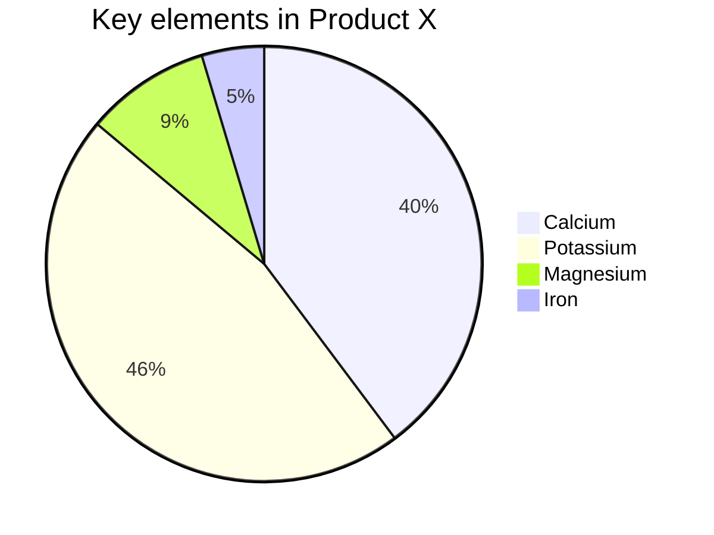

# Doc^red:+^ 基础 Markdown 语法

<center style="font-size:90%"><i>Doc<sup style="color:red;">+</sup> 基于 <a href="https://github.com/doocs/md" target="_blank" rel="noopener noreferrer">Doocs</a></i></center>

## 前言

> We believe that writing is about content, about what you want to say – not about fancy formatting.
> 我们坚信写作写的是内容，所思所想，而不是花样格式。— Ulysses for Mac


## 标题

用 `#` 号来创建标题。标题从 `#` 开始，`#` 的数量表示标题的级别。

```markdown
# 一级标题

## 二级标题

### 三级标题

#### 四级标题
```

以上代码将渲染出一组层次分明的标题，使你的内容井井有条。

## 段落与换行

Markdown 中的段落就是一行接一行的文本。要创建新段落，只需在两行文本之间空一行。

## 文字样式

- **粗体**：用两个星号或下划线包裹文字或`Command + B`，如 `**粗体**` 或 `__粗体__`。 
- _斜体_：用一个星号或下划线包裹文字或`Command + I`，如 `*斜体*` 或 `_斜体_`。
- ~~删除线~~：用两个波浪线包裹文字或`Command + D`，如 `~~删除线~~`。
- ++下划线++：用两个 `+` 包裹文字或`Command + U`，如 `++下划线++`。

这些简单的标记可以让你的内容更有层次感和重点突出。另外还提供额外的样式设置，快捷键：`Command + J`

=white:theme:12 白色文字，主题色背景，12px 大小的文字=

=white:black:12 白色文字，黑色背景，12px 大小的文字=

## 上标下标

- **上标**：用`^`包裹上标并可通过`:`指定颜色。`Command + Option + P`
` Docs^red:+^ ` ： Docs^red:+^ 。 
` Docs^theme:+^ `：跟随主题色。Docs^theme:+^
- **下标**：用`～`包裹上标并可通过`:`指定颜色。`Command + Option + B`
` H~red:2~O^ ` ： H~red:2~O 。 
` H~theme:2~O^ `：跟随主题色。H~theme:2~O^。 

## 列表

- **无序列表**：用 `-`、`*` 或 `+` 加空格开始一行。`Command + Option + U`
- **有序列表**：使用数字加点号（`1.`、`2.`）开始一行。`Command + Option + O`


在列表中嵌套其他内容？只需缩进即可实现嵌套效果。

- 无序列表项 1
  1. 嵌套有序列表项 1
  2. 嵌套有序列表项 2
- 无序列表项 2

1. 有序列表项 1
2. 有序列表项 2

## 链接与图片

- **链接**：用方括号和圆括号创建链接 `Command + K`
`[访问 Docs^red:+^ ](https://github.com/iniself/md)`。[访问 Docs^red:+^ ](https://github.com/iniself/md)。
 =rgb(128, 128, 128)::90% 微信公众号平台不支持除公众号内容以外的链接。或点击左上角「格式->微信外链接转底部引用」开启引用，这样就可以在底部++引用链接++处看到链接指向。=
- **知乎卡片链接**：链接外层再叠加括号 `[[显示文本](链接地址)]`。`Command + Option + K`
- **图片**：和链接类似，只需在前面加上 `!`。Docs^red:+^ 支持定义图片长宽（`px` | `%`）和填充方式（`contain` | `cover` | `fill` ...）：
````

另外，使用 `<,>` 语法可以创建横屏滑动幻灯片，支持微信公众号平台。建议使用相似尺寸的图片以获得最佳显示效果。

## 引用

使用 `>` 来创建引用，只需在文本前面加上它。多层引用？在前一层 `>` 后再加一个就行。

> 这是一个引用
>
> > 这是一个嵌套引用

这让你的引用更加富有层次感。

## 代码块

- **行内代码**：用反引号包裹，如 `` `code` `` ：code`。
- **代码块**：用三个反引号包裹，并指定语言，如：
    ```js    
    console.log("Hello, You!");
    ```

## 提示块

Docs^red:+^ 支持 Admonition 语法， `Command + Option + A`。包括如下提示类型：
`abstract/attention/bug/caution/danger/error/example/failure/hint/info/note/question/quote/success/tip/warning`

!!! bug 越界访问，索引 3 不存在 
```rust
fn main() {
    let nums = vec![1, 2, 3];
    println!("{}", nums[3]); 
}
```
!!!

## 分割线

用三个或更多的 `-`、`*` 或 `_` 来创建分割线。

---


## 注释
不想渲染出来的 markdown 内容可以通过 `<!--  -->` 进行注释。`Command + /`

<!-- # 被注释的内容 -->

## 表格

Markdown 最简单的表格语法是，用 `|` 和 `-` 分隔单元格和表头。通过左上方点击「编辑->插入表格」，可快速生成表格。

### 基本表格

| 成员 | 性别 | 年龄 |
| --- | --- | --- |
|张三       | 男      |  28      |
|李四       | 男      |  33     |
|王五       | 女      |  21     |

另外 Docs^red:+^ 还提供了更高级的表格用法：


### 合并列


| 成都      | 绵阳      | 自贡      |
|---------|---------|---------|
|四川省  |||


### 合并行

| 省          | 城市      |
|--------------|---------|
| 四川    | 成都  |
| ^| 绵阳  |
| ^|  自贡  |

### 合并行和列

| 这个表头合并   || 表头 A |
|了两行和两列^|| 表头 B |
|-------------|------------|----------|
| 单元格 A      |单元格 B     |单元格 C   |

### 指定列宽

|列一|列二|列三|
|--10%-----|-- 40% ---|:---50%-----|
|10% 宽度|40%宽度|50%宽度|

### 列样式

|cols       |       |
| --- | --- |
|⭐️⭐️⭐️⭐️⭐️|主数据管理|
|⭐️⭐️|元数据管理|
|⭐️⭐️⭐️⭐|数据标准建设|
|⭐️⭐️⭐️⭐️⭐️|数据质量监控|


# Doc^red:+^ 进阶 Markdown 语法

## LaTeX 公式：完美展示数学表达式

Markdown 允许嵌入 LaTeX 语法展示数学公式：

- **行内公式**：用 `$` 包裹公式，如 `$E = mc^2$` $E = mc^2$。
- **块级公式**：用 `$$` 包裹公式，如：

  $$
  \begin{aligned}
  d_{i, j} &\leftarrow d_{i, j} + 1 \\
  d_{i, y + 1} &\leftarrow d_{i, y + 1} - 1 \\
  d_{x + 1, j} &\leftarrow d_{x + 1, j} - 1 \\
  d_{x + 1, y + 1} &\leftarrow d_{x + 1, y + 1} + 1
  \end{aligned}
  $$

1. 列表内块公式 1
    $$
    \chi^2 = \sum \frac{(O - E)^2}{E}
    $$
    
2. 列表内块公式 2
    $$
    \chi^2 = \sum \frac{(|O - E| - 0.5)^2}{E}
    $$


## Mermaid 流程图：可视化流程

Mermaid 是强大的可视化工具，可以在 Markdown 中创建流程图、时序图等。Doc^red:+^ 支持设置图形大小和标题。


---


---


---

> 更多用法，参见：[Mermaid User Guide](https://mermaid.js.org/intro/getting-started.html)。

## 结语

淘汰一切以打印为目的的文档格式。内容和样式分离才是面向 AI 时代正确的写作方式。加我微信 **Aui_Team** 聊天。


